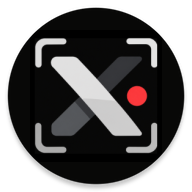

<div align="center">

  

# ScreenX

**Pure, powerful screen recording for Android. No limits, no nonsense.**

  <p>
    <a href="https://github.com/gtxprime/screen-x/stargazers">
      
    </a>
    <a href="https://github.com/gtxprime/screen-x/network/members">
      
    </a>
    <a href="https://github.com/gtxprime/screen-x/issues">
      
    </a>
    <a href="https://github.com/gtxprime/screen-x/blob/main/LICENSE">
      
    </a>
    <a href="#">
      
    </a>
    <a href="https://github.com/gtxprime/screen-x/releases/latest">
      
    </a>
  </p>

  <a href="https://github.com/gtxprime/screen-x/releases/latest">
    
  </a>

  <h3>
    <a href="#-features">Features</a>
    <span> &bull; </span>
    <a href="#-tech-stack">Tech Stack</a>
    <span> &bull; </span>
    <a href="#-project-structure">Project Structure</a>
    <span> &bull; </span>
    <a href="#-installation">Installation</a>
    <span> &bull; </span>
    <a href="#-roadmap">Roadmap</a>
    <span> &bull; </span>
    <a href="#-contributing">Contributing</a>
  </h3>

</div>

---

##  About ScreenX

> [!NOTE]
> **ScreenX** is a modern, high-performance screen recording utility built for Android. It prioritizes smooth performance, minimal system overhead, and useful productivity features like live annotations and floating overlays. Whether you're recording gameplay, creating app walkthroughs, or capturing bug reports, ScreenX handles it with style.

---

## <a id="-features"></a> Core Features

###  Stealth Recording (Wireless ADB)
> Completely rootless, background recording without system prompts or app-level detection.

*  **Undetected by Apps:** Runs via a local Android Debug Bridge (ADB) daemon session. Because it operates outside the standard `MediaProjection` API surface, apps that actively monitor screen recording listeners (such as **Snapchat**) won't detect or trigger recording notifications.
*  **1-Tap Notification Pairing:** Easily pair your device using Android 11+ Wireless Debugging&mdash;simply tap Reply on the ScreenX notification and submit your 6-digit code.
*  **Zero-Config mDNS Discovery:** Automatically scans and detects wireless debugging ports on your local Wi-Fi.
*  **Video-Only (No Audio/Voice):** Runs on Android's native `screenrecord` shell command, which only captures the display surface. It **does not record audio or voice** (internal or microphone audio is not captured in Stealth mode). Use standard recording mode if audio capture is required.
*  **Limitations & `FLAG_SECURE`:** 
  > [!IMPORTANT]
  > Stealth Recording **cannot bypass Android's OS-level `FLAG_SECURE`**. Banking apps, DRM video players (e.g. Netflix, Prime Video), or protected views that explicitly set `WindowManager.LayoutParams.FLAG_SECURE` will be rendered as black screens by Android's hardware surface flinger.

---

###  High-Fidelity Recording
> Configure video output exactly to your device and storage needs.

*  **Custom Configurations:** Adjust resolution (up to 1080p+), frame rates (30/60 FPS), and bitrates.
*  **Format Control:** Output `.mp4` video files using hardware-accelerated MediaCodec API.
*  **Dynamic Orientation:** Adapts recording orientation automatically based on device state.

---

###  Capture Options
> Clean sound options for any recording context.

*  **Synchronized Dual Audio:** Record internal system audio and external microphone audio simultaneously with synchronized sample interleaving.
*  **Audio Sources:** Switch effortlessly between Microphone, System Audio (Android 10+), or Dual Audio.
*  **Custom Quality:** Configure sample rates and audio bitrates for crystal-clear sound.

---

###  Live Annotations & Brush
> Annotate your screen on-the-fly while recording is active.

*  **Draw on Screen:** Canvas overlay lets you draw directly on top of active apps.
*  **Custom Styling:** Choose brush colors dynamically and adjust brush size.
*  **Quick Actions:** Erase strokes or clear the canvas instantly.

---

###  Floating Control Panel
> Non-intrusive widget for quick, easy management.

*  **Quick Access:** Expanded controls for record, pause, stop, and brush tools.
*  **Smart Snapping:** Drag-and-drop widget snaps to screen edges and saves position.
*  **Auto-Hide:** Fades/hides during inactivity or user interaction.

---

###  Quick Settings Tile Integration
> Start recording in a single tap without opening the main app interface.

*  **One-Tap Recording:** Instantly initiate or stop recordings directly from Android Quick Settings.
*  **Background Launching:** Handles foreground service and media projection requests seamlessly.

---

## <a id="-tech-stack"></a> Tech Stack & Architecture

ScreenX is designed with modern Android development practices, ensuring scalability, performance, and clean code division:

* **Language:** 100% Kotlin
* **UI Framework:** Jetpack Compose with Material Design 3 and AGSL (Android Graphics Shading Language) dynamic hardware-accelerated shaders
* **Background Tasks:** Android Foreground Services (`ScreenRecordService`, `AdbRecordService`, `PairingInputService`)
* **Media Pipelines:** MediaProjection API, Wireless ADB daemon capture, and synchronized dual `AudioRecord` / `AudioPlaybackCapture`
* **State Management:** Kotlin Coroutines and Flows for reactive settings management
* **Data Layer:** Jetpack DataStore Preferences for storing user configurations

---

## <a id="-project-structure"></a> Project Structure

```
screen-x
│
├── app/src/main/java/com/gxdevs/screenx/
│   ├── data/
│   │   ├── AdbManager.kt            # TLS key-exchange, pairing, and ADB daemon commands
│   │   ├── AdbMdns.kt               # Local mDNS discovery for Wireless Debugging ports
│   │   └── SettingsManager.kt       # Manages recording, audio, and UI settings
│   │
│   ├── service/
│   │   ├── ScreenRecordService.kt   # Standard MediaProjection recording service
│   │   ├── AdbRecordService.kt      # Stealth recording service via local ADB socket
│   │   ├── PairingInputService.kt   # Background notification reply receiver for pairing
│   │   ├── AudioCaptureHelper.kt    # Synchronized dual internal & microphone audio capture
│   │   ├── FloatingControlOverlay.kt # Draggable overlay control panel
│   │   ├── BrushDrawingOverlay.kt   # Canvas overlay for drawing on screen
│   │   ├── CountdownOverlay.kt      # Initial countdown overlay before recording
│   │   ├── ScreenXTileService.kt    # Quick Settings Tile service
│   │   └── TileHelperActivity.kt    # Invisible activity helper for tile launches
│   │
│   ├── ui/
│   │   ├── components/
│   │   │   └── ShaderGradientCard.kt # AGSL brushed gunmetal metallic shader with touch ripple
│   │   ├── screens/
│   │   │   ├── HomeScreen.kt        # Home UI with stealth/standard modes & video gallery
│   │   │   └── SettingsScreen.kt    # Material You stacked settings & audio configurations
│   │   └── theme/
│   │       ├── Color.kt             # Material 3 theme colors & dark container styling
│   │       ├── Theme.kt             # Application theme initialization
│   │       └── Type.kt              # Font and typography settings
│   │
│   ├── utils/
│   │   └── VideoHelper.kt           # Utilities for video file queries and deletions
│   │
│   └── MainActivity.kt              # Entry point activity handling permissions & navigation
```

---

## <a id="-installation"></a> Installation & Development Setup

### Prerequisites
* Android Studio (Ladybug or newer recommended)
* Android SDK 26 (Android 8.0) or higher
* Java Development Kit (JDK) 17

### Building from Source
1. Clone the repository:
   ```bash
   git clone https://github.com/gtxprime/screen-x.git
   cd screen-x
   ```
2. Open the project in Android Studio.
3. Sync Gradle and build the project:
   ```bash
   ./gradlew assembleRelease
   ```
4. Run the app on a connected physical device or emulator.

---

## <a id="-roadmap"></a> Upcoming Roadmap

Here are features actively in development and planned for upcoming updates:

* [ ]  **Camera Overlay (Facecam):** Floating front/back camera bubble overlay on the screen while recording, with drag-to-move, pinch-to-resize, and circular/rectangular shape customization.
* [x]  **Simultaneous Dual Audio:** Concurrent mic and system audio capture with hardware sample synchronization.
* [x]  **Stealth Recording Mode:** Background rootless capture without app-level recording alerts.
* [ ]  **Cloud Backup & Instant Sharing:** Optional export and compression presets optimized for messaging apps.

---

## <a id="-contributing"></a> Contributing

Contributions are welcome! If you find bugs, have feature requests, or want to enhance ScreenX:
1. **Fork** the repository.
2. **Create a branch** for your feature/bug fix (`git checkout -b feature/amazing-feature`).
3. **Commit** your changes (`git commit -m 'Add amazing feature'`).
4. **Push** to the branch (`git push origin feature/amazing-feature`).
5. **Open a Pull Request**.

Please read [CONTRIBUTING.md](CONTRIBUTING.md) for more details.

---

##  Star History

[](https://star-history.com/#gtxprime/screen-x&Date)

---

##  License

This project is licensed under the MIT License. See [LICENSE](LICENSE) for details.
